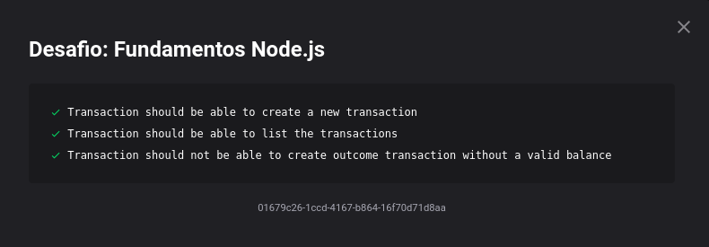

<h1 align="center">
  Desafio 05: Fundamentos NodeJS
</h1>

<blockquote align="center">“Não espere para plantar, apenas tenha paciência para colher”!</blockquote>

## Sobre o desafio 
Quinto desafio técnico do GoStack 13.0!  
Fizemos uma API simples com NodeJS para comprovar que entendemos os conceitos do NodeJS utilizando o conceito de models, repositories e services! Que foi explicado nas primeiras aulas do bootcamp  
Foi usado o Jest (uma estrutura de testes criada pelo Facebook) para realizar os testes e ver se passamos no desafio, os testes eram os seguintes 🛠 
  
</img>
  
Para mais detalhes sobre o desafio e que era precisa ser feito para ser passado em cada teste, você pode ver neste <a href="https://github.com/rocketseat-education/bootcamp-gostack-desafios/tree/master/desafio-fundamentos-nodejs">link</a>.

## Resultado dos testes
 
</img>

## Author:

* **Paulo Vaz** - [LinkedIn](https://www.linkedin.com/in/paulo-vaz-05296a46/)

## Acknowledgments

Este projeto foi construído durante as aulas do GoStack  da [RocketSeat](https://rocketseat.com.br/).